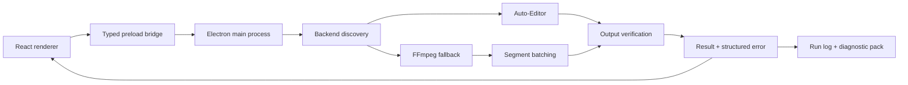

# QuietCut: Engineering Overview

> A Windows-first Electron workstation that removes silence from video through Auto-Editor or a resilient FFmpeg fallback, with structured diagnostics and regression-tested failure handling.

## At a glance

| Area | Implementation |
| --- | --- |
| Product | Local desktop video silence cutter with progress, cancellation, settings, results, and diagnostics |
| Core stack | Electron, React 19, TypeScript, Vite, Auto-Editor, FFmpeg |
| Architecture | Sandboxed renderer-to-main IPC, backend discovery, command construction, processing, output verification, and diagnostics |
| Packaging | Windows NSIS configuration through Electron Builder |
| Verification | Type checks, Vitest regression tests, build checks, and external-tool smoke runners |

## Why this project is technically interesting

QuietCut looks simple at the product level—choose a video and remove silence—but its engineering work sits at the boundary between desktop UI, child processes, operating-system limits, media tooling, and trustworthy output reporting.

- **Dual processing backends.** The app detects Auto-Editor and FFmpeg independently, records why each backend is or is not available, and selects an executable path at runtime.
- **Windows command-length hardening.** Hundreds of detected keep/cut segments can exceed `CreateProcess` limits. The FFmpeg fallback batches segments and concatenates intermediate outputs, keeping command size bounded.
- **Output truth repair.** A successful process is not accepted blindly. The backend verifies file existence, non-zero size, modification time, expected or alternate locations, and reports path mismatches explicitly.
- **Typed desktop boundary.** Renderer code talks to the Electron main process through a narrow `contextBridge` API backed by shared TypeScript contracts.
- **Actionable failure reporting.** Errors include backend, failed step, probable cause, technical cause, suggested action, run ID, and log path.
- **Privacy-aware diagnostics.** Diagnostic packs contain logs and tool metadata but exclude the source video by default.
- **Safe cancellation and collision handling.** Runs can be cancelled, and generated output names avoid silently overwriting prior files.

## System shape



## Guided code tour

1. **`electron/backend.ts`**
   Backend detection, command building, FFmpeg batching, process execution, cancellation, output verification, and diagnostic collection.
2. **`electron/types.ts`**
   Shared processing, diagnostics, result, and error contracts.
3. **`electron/preload.ts`**
   Narrow renderer-to-main API exposed through Electron's context bridge.
4. **`electron/main.ts`**
   Window lifecycle and IPC handler registration.
5. **`src/App.tsx` and `src/components/`**
   Desktop workflow, settings, progress, results, and diagnostics UI.
6. **`test/command-builder.test.ts`**
   Command-generation behavior across processing options.
7. **`test/enametoolong-regression.test.ts`**
   Regression coverage for bounded command size on large segment sets.
8. **`test/regression.test.ts` and smoke runners**
   Output paths, failure cases, real media tools, and diagnostic behavior.

## Engineering decisions worth discussing

### 1. Child-process success is not product success

The backend verifies the expected media artifact and can locate valid alternate outputs. This prevents the UI from reporting either false success or false failure based only on an exit code.

### 2. Platform constraints shape the algorithm

The FFmpeg strategy is intentionally different for large segment counts. Batching and concat-demuxer assembly trade extra intermediate work for predictable command size on Windows.

### 3. Diagnostics are part of the product

Backend discovery, checked paths, tool versions, run summaries, raw logs, and structured errors are accessible to the operator. Debuggability is designed into the application rather than left to console output.

### 4. The renderer receives capabilities, not Node.js

The preload bridge exposes specific actions and typed results. This creates a reviewable IPC surface and keeps filesystem/process access in the Electron main process.

## Verification

```bash
npm ci
npm run typecheck
npm test
npm run build
```

External-backend smoke checks require FFmpeg or Auto-Editor plus test media:

```bash
node test/smoke_runner.js many
node test/smoke_runner.js short
node test/failure_path_runner.js
```

The public snapshot's install, type check, unit tests, and production build can run without a source video. Media smoke tests are a separate environment-dependent tier.

## For coding agents

1. Read `AGENTS.md` and this overview before changing process behavior.
2. Preserve the typed preload boundary; do not expose general filesystem or shell access to the renderer.
3. Treat command length, path normalization, file collisions, and cancellation as cross-cutting invariants.
4. Add regression coverage for every process or output-verification bug.
5. Keep diagnostic packs source-video-free unless the user explicitly chooses otherwise.
6. Run type checks, tests, and both renderer/electron builds before handoff.

## Current boundaries

- The shipped workflow is Windows-first and depends on locally installed or bundled media tools.
- Real-media smoke tests are environment-dependent and are not equivalent to the credential-free unit suite.
- The fallback verifier uses defensive filesystem heuristics; modification-time checks reduce stale-file risk but do not make arbitrary directories trustworthy.
- `RUN_STATE.md` is a preserved pre-publication development checkpoint, not the current Git state of this public snapshot.
- The repository currently has no GitHub Actions workflow; verification is local until CI is added.

## What this repository demonstrates

QuietCut demonstrates practical systems engineering across a desktop security boundary, external processes, media algorithms, Windows platform limits, resilient output handling, and operator-focused diagnostics.
